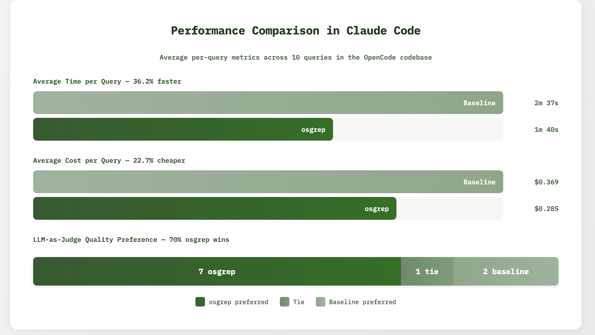

<div align="center">
  <h1>osgrep</h1>
  <p><em>Slash tokens. Save time. Semantic search for your coding agent.</em></p>

  <a href="https://opensource.org/licenses/Apache-2.0">
    
  </a>

  <a href="https://deepwiki.com/Ryandonofrio3/osgrep">
    
  </a>

<a>
  
</a>
</div>


Natural-language search that works like `grep`. Fast, local, and built for coding agents.

- **Semantic:** Finds concepts ("where do transactions get created?"), not just strings.
- **Call Graph Tracing:** Map dependencies with `trace` to see who calls what.
- **Role Detection:** Distinguishes `ORCHESTRATION` (high-level logic) from `DEFINITION` (types/classes).
- **Local & Private:** 100% local embeddings via `onnxruntime-node`.
- **Auto-Isolated:** Each repository gets its own index automatically.
- **Agent-Ready:** Native output with symbols, roles, and call graphs.

## Quick Start

1. **Install**
   ```bash
   npm install -g osgrep
   ```

2.  **Setup (Recommended)**

    ```bash
    osgrep setup
    ```

    Downloads embedding models (~150MB) upfront. If you skip this, models download automatically on first use.

3.  **Search**

    ```bash
    cd my-repo
    osgrep "where do we handle authentication?"
    ```

    **Your first search will automatically index the repository.** Each repository is automatically isolated with its own index. Switching between repos "just works" — no manual configuration needed. If the background server is running (`osgrep serve`), search goes through the hot daemon; otherwise it falls back to on-demand indexing.

4.  **Trace** (Call Graph)

    ```bash
    osgrep trace "function_name"
    ```
See who calls a function (upstream dependencies) and what it calls (downstream dependencies). Perfect for impact analysis and understanding code flow.

To find the symbols in your code base:
    ```bash
    osgrep symbols
    ```

In our public benchmarks, `osgrep` can save about 20% of your LLM tokens and deliver a 30% speedup.

<div align="center">
  
</div>


### Claude Code Plugin

1. Run `osgrep install-claude-code`
2. Open Claude Code (`claude`) and ask it questions about your codebase.
3. Highly recommend indexing your code base before using the plugin.
4. The plugin's hooks auto-start `osgrep serve` in the background and shut it down on session end. Claude will use `osgrep` for semantic searches automatically but can be encouraged to do so.

## Opencode Plugin
1. Run `osgrep install-opencode`
2. Open OC (`opencode`) and ask it questions about your codebase.
3. Highly recommend indexing your code base before using the plugin.
4. The plugin's hooks auto-start `osgrep serve` in the background and shut it down on session end. OC will use `osgrep` for semantic searches automatically but can be encouraged to do so.


## Commands

### `osgrep search`

The default command. Searches the current directory using semantic meaning.

```bash
osgrep "how is the database connection pooled?"
```

**Options:**

| Flag | Description | Default |
| --- | --- | --- |
| `-m <n>` | Max total results to return. | `25` |
| `--per-file <n>` | Max matches to show per file. | `1` |
| `-c`, `--content` | Show full chunk content instead of snippets. | `false` |
| `--scores` | Show relevance scores (0-1) for each result. | `false` |
| `--min-score <n>` | Filter out results below this score threshold. | `0` |
| `--compact` | Show file paths only (like `grep -l`). | `false` |
| `-s`, `--sync` | Force re-index changed files before searching. | `false` |
| `-r`, `--reset` | Reset the index and re-index from scratch. | `false` |
**Examples:**

```bash
# General concept search
osgrep "API rate limiting logic"

# Deep dive (show more matches per file)
osgrep "error handling" --per-file 5

# Just give me the files
osgrep "user validation" --compact

# Show relevance scores and filter low-confidence matches
osgrep "authentication" --scores --min-score 0.5
```

### `osgrep index`

Manually indexes the repository. Useful if you want to pre-warm the cache or if you've made massive changes outside of the editor.

- Respects `.gitignore` and `.osgrepignore` (see [Configuration](#ignoring-files) section).
- **Smart Indexing:** Only embeds code and config files. Skips binaries, lockfiles, and minified assets.
- **Bounded Concurrency:** Uses a fixed thread pool to keep your system responsive.
- **Semantic Chunking:** Uses TreeSitter grammars for supported languages (TypeScript, JavaScript, Python, Go, Rust, C/C++, Java, C#, Ruby, PHP, JSON, YAML, Kotlin, Swift, Dart).

**Options:**

| Flag | Description | Default |
| --- | --- | --- |
| `-d`, `--dry-run` | See what would be indexed without making changes. | `false` |
| `-p`, `--path <dir>` | Path to index (defaults to current directory). | `.` |
| `-r`, `--reset` | Remove existing index and re-index from scratch. | `false` |
| `-v`, `--verbose` | Show detailed progress with file names. | `false` |
| `--allow-fallback` | Also index files without TreeSitter grammar support. | `false` |

**Examples:**

```bash
osgrep index                    # Index current dir
osgrep index --dry-run          # See what would be indexed
osgrep index --verbose          # Watch detailed progress (useful for debugging)
osgrep index --allow-fallback   # Include files without grammar support
osgrep index --reset            # Full re-index from scratch
```

### `osgrep serve`

Runs a lightweight HTTP server with live file watching so searches stay hot in RAM.

- Keeps LanceDB and the embedding worker resident for <50ms responses.
- Watches the repo (via chokidar) and incrementally re-indexes on change.
- Health endpoint: `GET /health`
- Search endpoint: `POST /search` with `{ query, limit, path, rerank }`
- Writes lock: `.osgrep/server.json` with `port`/`pid`

**Options:**

| Flag | Description |
| --- | --- |
| `-p, --port <port>` | Port to listen on (auto-increments if not specified) |
| `-b, --background` | Run server in background and exit immediately |

**Port Selection (priority order):**
1. Explicit `-p <port>` flag
2. `OSGREP_PORT` environment variable
3. Auto-increment from registry (last used port + 1, or 4444 if no servers)

**Usage:**

```bash
osgrep serve                    # Foreground, port 4444 (or next available)
osgrep serve --background       # Background mode, auto port
osgrep serve -b -p 5000         # Background on specific port
```

**Subcommands:**

```bash
osgrep serve status             # Show server status for current directory
osgrep serve stop               # Stop server in current directory
osgrep serve stop --all         # Stop all running osgrep servers
```

**Example workflow:**

```bash
# Start servers in multiple projects
cd ~/project-a && osgrep serve -b    # Starts on port 4444
cd ~/project-b && osgrep serve -b    # Starts on port 4445 (auto-increment)

# Check status
osgrep serve status

# Stop all when done
osgrep serve stop --all
```

Claude Code hooks start/stop this automatically; you rarely need to run it manually.

### `osgrep list`

Lists all indexed repositories (stores) and their metadata.

```bash
osgrep list
```

Shows store names, sizes, and last modified times. Useful for seeing what's indexed and cleaning up old stores.

### `osgrep skeleton`

Generates a compressed "skeleton" of a file, showing only signatures, types, and class structures while eliding function bodies.

```bash
osgrep skeleton src/lib/auth.ts
```

**Output:**
```typescript
class AuthService {
  validate(token: string): boolean {
    // → jwt.verify, checkScope, .. | C:5 | ORCH
  }
}
```

**Modes:**
- `osgrep skeleton <file>`: Skeletonize specific file.
- `osgrep skeleton <Symbol>`: Find symbol in index and skeletonize its file.
- `osgrep skeleton "query"`: Search for query and skeletonize top matches.

**Supported Languages:**
TypeScript, JavaScript, Python, Go, Rust, Java, C#, C++, C, Ruby, PHP.


### `osgrep doctor`

Checks installation health, model paths, and database integrity.

```bash
osgrep doctor
```

## Performance & Architecture

osgrep is designed to be a "good citizen" on your machine:

1.  **Bounded Concurrency:** Chunking/embedding stay within small thread pools (1–4) and capped batch sizes to keep laptops responsive.
2.  **Smart Chunking:** Uses `tree-sitter` to split code by function/class boundaries, ensuring embeddings capture complete logical blocks.
3.  **Deduplication:** Identical code blocks (boilerplate, license headers) are embedded once and cached, saving space and time.
4.  **Semantic Split Search:** Queries both "Code" and "Docs" separately to ensure documentation doesn't drown out implementation details, then reranks with ColBERT.
5.  **Global Batching:** A producer/consumer pipeline decouples chunking from embedding. Files are chunked concurrently, queued, embedded in fat batches, and written to LanceDB in bulk.
6.  **Anchor-Only Scans & Batch Deletes:** File discovery and stale cleanup hit only anchor rows, and stale/changed paths are removed with a single `IN` delete to minimize I/O.
7.  **Structural Boosting:** Function/class chunks get a small score boost; test/spec paths are slightly downweighted to bubble up primary definitions first.
8.  **Role Classification:** Detects `ORCHESTRATION` functions (high complexity, many calls) vs `DEFINITION` (types/classes) to help agents prioritize where to read.

## Configuration

### Automatic Repository Isolation

osgrep automatically creates a unique index for each repository based on:

1. **Git Remote URL** (e.g., `github.com/facebook/react` → `facebook-react`)
2. **Git Repo without Remote** → directory name + hash (e.g., `utils-7f8a2b3c`)
3. **Non-Git Directory** → directory name + hash for collision safety

**Examples:**
```bash
cd ~/work/myproject        # Auto-detected: owner-myproject
osgrep "API handlers"

cd ~/personal/utils        # Auto-detected: utils-abc12345
osgrep "helper functions"
```

Stores are isolated automatically — no manual `--store` flags needed!

### Ignoring Files

osgrep respects both `.gitignore` and `.osgrepignore` files when indexing. Create a `.osgrepignore` file in your repository root to exclude additional files or patterns from indexing.

**`.osgrepignore` syntax:**
- Uses the same pattern syntax as `.gitignore`
- Patterns are relative to the repository root
- Supports glob patterns, negation (`!`), and directory patterns (`/`)


### Manual Store Management

- **View all stores:** `osgrep list`
- **Override auto-detection:** `osgrep --store custom-name "query"`
- **Clean up old stores:** `rm -rf ~/.osgrep/data/store-name`
- **Data location:** `~/.osgrep/data`

## Development

```bash
pnpm install
pnpm build        # or pnpm dev
pnpm format       # biome check
```

## Troubleshooting

- **Index feels stale?** Run `osgrep index` to refresh.
- **Weird results?** Run `osgrep doctor` to verify models.
- **Index getting stuck?** Run `osgrep index --verbose` to see which file is being processed.
- **Want faster indexing?** Keep fallback disabled (default) to skip files without TreeSitter support.
- **Need a fresh start?** Delete `~/.osgrep/data` and `~/.osgrep/meta.json` and run `osgrep index`.

## Attribution

osgrep is built upon the foundation of [mgrep](https://github.com/mixedbread-ai/mgrep) by MixedBread. We acknowledge and appreciate the original architectural concepts and design decisions that informed this work.


See the [NOTICE](NOTICE) file for detailed attribution information.

## License

Licensed under the Apache License, Version 2.0.
See [LICENSE](LICENSE) and [Apache-2.0](https://opensource.org/licenses/Apache-2.0) for details.

