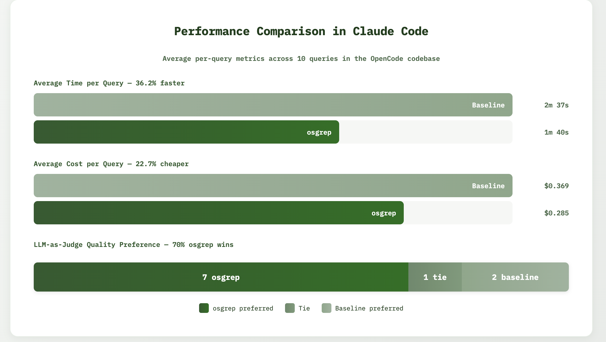

<div align="center">
  <h1>grepmax</h1>
  <p><em>Slash tokens. Save time. Semantic search for your coding agent.</em></p>

  <a href="https://opensource.org/licenses/Apache-2.0">
    
  </a>

  <a href="https://deepwiki.com/reowens/grepmax">
    
  </a>

<a>
  
</a>
</div>


Natural-language search that works like `grep`. Fast, local, and built for coding agents.

- **Semantic:** Finds concepts ("where do transactions get created?"), not just strings.
- **Call Graph Tracing:** Map dependencies with `trace` to see who calls what.
- **Role Detection:** Distinguishes `ORCHESTRATION` (high-level logic) from `DEFINITION` (types/classes).
- **Local & Private:** 100% local embeddings via ONNX (CPU) or MLX (Apple Silicon GPU).
- **Centralized Index:** One database at `~/.gmax/` — index once, search from anywhere.
- **LLM Summaries:** Optional Qwen3-Coder generates one-line descriptions per code chunk at index time.
- **Agent-Ready:** Pointer mode returns metadata (symbol, role, calls, summary) — no code snippets, ~80% fewer tokens.

## Quick Start

1. **Install**
   ```bash
   npm install -g grepmax
   ```

2.  **Setup (Recommended)**

    ```bash
    gmax setup
    ```

    Downloads embedding models (~150MB) upfront and lets you choose between CPU (ONNX) and GPU (MLX) embedding modes. If you skip this, models download automatically on first use.

3.  **Index**

    ```bash
    cd my-repo
    gmax index
    ```

    Indexes into a centralized store at `~/.gmax/lancedb/`. You can index any directory — a single repo, a monorepo, or an entire workspace.

4.  **Search**

    ```bash
    gmax "where do we handle authentication?"
    ```

5.  **Trace** (Call Graph)

    ```bash
    gmax trace "function_name"
    ```
    See who calls a function (upstream dependencies) and what it calls (downstream dependencies).

    ```bash
    gmax symbols                  # List all indexed symbols
    ```

In our public benchmarks, `grepmax` can save about 20% of your LLM tokens and deliver a 30% speedup.

<div align="center">
  
</div>

## Agent Plugins

### Claude Code

1. Run `gmax install-claude-code`
2. Open Claude Code — the plugin auto-starts the MLX GPU server and a background file watcher.
3. Claude uses `gmax` for semantic searches automatically via MCP tools.

Plugin files (skill instructions, hooks) auto-update when you run `npm update -g grepmax` — no need to re-run `install-claude-code`.

### Opencode
1. Run `gmax install-opencode`
2. OC uses `gmax` for semantic searches via MCP.

### Codex
1. Run `gmax install-codex`
2. Codex uses `gmax` for semantic searches.

### Factory Droid
1. Run `gmax install-droid`
2. To remove: `gmax uninstall-droid`

### MCP Server

`gmax mcp` starts a stdio-based MCP server that searches the centralized index directly — no HTTP daemon needed.

| Tool | Description |
| --- | --- |
| `semantic_search` | Code search by meaning. 16 composable params: query, limit, root, path, detail (pointer/code/full), context_lines, min_score, max_per_file, file, exclude, language, role, mode (symbol), include_imports, name_pattern. |
| `search_all` | Search ALL indexed code. Same params + `projects`/`exclude_projects` to scope by project name. |
| `code_skeleton` | Collapsed file structure (~4x fewer tokens). Accepts files, directories, or comma-separated paths. `format: "json"` for structured output. |
| `trace_calls` | Call graph with importers, callers (multi-hop via `depth`), and callees with file:line locations. |
| `list_symbols` | List indexed symbols with role (ORCH/DEF/IMPL) and export status. |
| `summarize_project` | High-level project overview — languages, directory structure, roles, key symbols, entry points. |
| `related_files` | Find dependencies and dependents of a file by shared symbol references. |
| `recent_changes` | Recently modified indexed files with relative timestamps. |
| `index_status` | Check index health: per-project chunk counts, model info, watcher status. |
| `summarize_directory` | Generate LLM summaries for indexed chunks. Summaries appear in search results. |

## Commands

### `gmax search`

The default command. Searches indexed code using semantic meaning.

```bash
gmax "how is the database connection pooled?"
```

**Options:**

| Flag | Description | Default |
| --- | --- | --- |
| `--agent` | Ultra-compact output for AI agents (one line per result). | `false` |
| `-m <n>` | Max total results to return. | `5` |
| `--per-file <n>` | Max matches to show per file. | `3` |
| `-c`, `--content` | Show full chunk content instead of snippets. | `false` |
| `-C <n>`, `--context <n>` | Include N lines before/after each result. | `0` |
| `--scores` | Show relevance scores (0-1) for each result. | `false` |
| `--min-score <n>` | Filter out results below this score threshold. | `0` |
| `--root <dir>` | Search a different project directory. | cwd |
| `--file <name>` | Filter to files matching this name (e.g. `syncer.ts`). | — |
| `--exclude <prefix>` | Exclude files under this path prefix (e.g. `tests/`). | — |
| `--lang <ext>` | Filter by file extension (e.g. `ts`, `py`). | — |
| `--role <role>` | Filter by role: `ORCHESTRATION`, `DEFINITION`, `IMPLEMENTATION`. | — |
| `--symbol` | Append call graph (importers, callers, callees) after results. | `false` |
| `--imports` | Prepend file imports to each result. | `false` |
| `--name <regex>` | Filter results by symbol name regex. | — |
| `--compact` | Compact hits view (paths + line ranges + role/preview). | `false` |
| `--skeleton` | Show code skeleton for matching files instead of snippets. | `false` |
| `--plain` | Disable ANSI colors and use simpler formatting. | `false` |
| `-s`, `--sync` | Force re-index changed files before searching. | `false` |

**Examples:**

```bash
gmax "API rate limiting logic"
gmax "auth handler" --role ORCHESTRATION --lang ts --agent
gmax "database" --file syncer.ts --agent
gmax "VectorDB" --symbol --agent
gmax "error handling" -C 5 --imports --plain
gmax "handler" --name "handle.*" --exclude tests/ --agent
```

> **For AI agents:** Use `--agent` for the most token-efficient output (~90% fewer tokens than default). Output format: `file:line symbol [role] — summary`

### `gmax index`

Index a directory into the centralized store.

- Respects `.gitignore` and `.gmaxignore`.
- Only embeds code and config files. Skips binaries, lockfiles, and minified assets.
- Uses TreeSitter for semantic chunking (TypeScript, JavaScript, Python, Go, Rust, C/C++, Java, C#, Ruby, PHP, Swift, Kotlin, JSON).
- Files already indexed with matching content are skipped automatically.

```bash
gmax index                        # Index current dir
gmax index --path ~/workspace     # Index a specific directory
gmax index --dry-run              # See what would be indexed
gmax index --verbose              # Watch detailed progress
gmax index --reset                # Full re-index from scratch
```

### `gmax watch`

Background file watcher for live reindexing. Watches for file changes and incrementally updates the centralized index.

```bash
gmax watch -b                     # Background mode (auto-stops after 30min idle)
gmax watch --path ~/workspace     # Watch a specific directory
gmax watch status                 # Show running watchers
gmax watch stop --all             # Stop all watchers
```

The MCP server auto-starts a watcher on session start. You rarely need to run this manually.

### `gmax serve`

HTTP server with live file watching. Useful for non-MCP integrations.

```bash
gmax serve                        # Foreground, port 4444
gmax serve --background           # Background mode
gmax serve --cpu                  # Force CPU-only embeddings
```

### `gmax trace`

Call graph — who imports a symbol, who calls it, and what it calls.

```bash
gmax trace handleAuth             # 1-hop trace
gmax trace handleAuth -d 2        # 2-hop: callers-of-callers
```

### `gmax skeleton`

Compressed view of a file — signatures with bodies collapsed. Supports files, directories, and batch.

```bash
gmax skeleton src/lib/auth.ts             # Single file
gmax skeleton src/lib/search/             # All files in directory
gmax skeleton src/a.ts,src/b.ts           # Batch
gmax skeleton src/lib/auth.ts --json      # Structured JSON output
gmax skeleton AuthService                 # Find symbol, skeletonize its file
```

**Supported Languages:** TypeScript, JavaScript, Python, Go, Rust, Java, C#, C++, C, Ruby, PHP, Swift, Kotlin.

### `gmax project`

High-level project overview — languages, directory structure, role distribution, key symbols, entry points.

```bash
gmax project                     # Current project
gmax project --root ~/workspace  # Different project
```

### `gmax related`

Find files related by shared symbol references — dependencies and dependents.

```bash
gmax related src/lib/index/syncer.ts
gmax related src/commands/mcp.ts -l 5
```

### `gmax recent`

Show recently modified indexed files with relative timestamps.

```bash
gmax recent                      # Last 20 modified files
gmax recent -l 10                # Last 10
gmax recent --root ~/workspace   # Different project
```

### `gmax config`

View or update configuration without the full interactive setup.

```bash
gmax config                          # Show current settings
gmax config --embed-mode cpu         # Switch to CPU embeddings
gmax config --embed-mode gpu         # Switch to GPU (MLX)
gmax config --model-tier standard    # Switch to standard model (768d)
```

### `gmax doctor`

Checks installation health, model paths, and database integrity.

```bash
gmax doctor
```

## Architecture

### Centralized Index

All data lives in `~/.gmax/`:
- `~/.gmax/lancedb/` — LanceDB vector store (one database for all indexed directories)
- `~/.gmax/cache/meta.lmdb` — file metadata cache (content hashes, mtimes)
- `~/.gmax/config.json` — global config (model tier, embed mode)
- `~/.gmax/models/` — embedding models
- `~/.gmax/grammars/` — Tree-sitter grammars
- `~/.gmax/projects.json` — registry of indexed directories

All chunks store **absolute file paths**. Search scoping is done via path prefix filtering. There are no per-project index directories.

### Performance

- **Bounded Concurrency:** Worker threads scale to 50% of CPU cores (min 4). Override with `GMAX_WORKER_THREADS`.
- **Smart Chunking:** `tree-sitter` splits code by function/class boundaries for complete logical blocks.
- **Deduplication:** Identical code blocks are embedded once and cached.
- **Multi-stage Search:** Vector search + FTS + RRF fusion + ColBERT reranking + structural boosting.
- **Role Classification:** Detects `ORCHESTRATION` (high complexity, many calls) vs `DEFINITION` (types/classes).

### GPU Embeddings (Apple Silicon)

On Macs with Apple Silicon, gmax defaults to MLX for GPU-accelerated embeddings. The MLX embed server runs on port `8100` and is managed automatically by the Claude Code plugin hook.

To force CPU mode: `GMAX_EMBED_MODE=cpu gmax index`

### LLM Summaries

gmax can generate one-line natural language descriptions for every code chunk using a local LLM (Qwen3-Coder-30B-A3B via MLX). Summaries are pre-computed at index time and stored in LanceDB — zero latency at search time.

The summarizer server runs on port `8101` and auto-starts alongside the embed server. If unavailable, indexing proceeds without summaries.

Example search output with summaries:
```
handleAuth [exported ORCH C:8] src/auth/handler.ts:45-90
  Validates JWT from Authorization header, checks RBAC permissions, returns 401 on failure
  parent:AuthController calls:validateToken,checkRole,respond
```

## Configuration

### Config File

Settings are stored in `~/.gmax/config.json`:

```json
{
  "modelTier": "small",
  "vectorDim": 384,
  "embedMode": "gpu",
  "mlxModel": "ibm-granite/granite-embedding-small-english-r2"
}
```

View and change settings with `gmax config` or run `gmax setup` for interactive configuration.

### Ignoring Files

gmax respects `.gitignore` and `.gmaxignore` files. Create a `.gmaxignore` in your directory root to exclude additional patterns:

```gitignore
# .gmaxignore — same syntax as .gitignore
docs/generated/
*.test.ts
fixtures/
```

### Index Management

- **View indexed directories:** `gmax list --all`
- **Index location:** `~/.gmax/lancedb/` (centralized)
- **Clean up:** `gmax index --reset` re-indexes the current directory from scratch
- **Full reset:** `rm -rf ~/.gmax/lancedb ~/.gmax/cache` to start completely fresh

### Environment Variables

| Variable | Description | Default |
| --- | --- | --- |
| `GMAX_WORKER_THREADS` | Number of worker threads for embedding | 50% of CPU cores |
| `GMAX_EMBED_MODE` | Force `cpu` or `gpu` embedding mode | Auto-detect |
| `GMAX_DEBUG` | Enable debug logging (`1` to enable) | Off |
| `GMAX_VERBOSE` | Enable verbose output (`1` to enable) | Off |
| `GMAX_WORKER_TASK_TIMEOUT_MS` | Worker task timeout in ms | `120000` |
| `GMAX_MAX_WORKER_MEMORY_MB` | Max worker memory in MB | 50% of system RAM |
| `GMAX_MAX_PER_FILE` | Default max results per file in search | `3` |

## Contributing

See [CLAUDE.md](CLAUDE.md) for development setup, commands, and architecture details.

## Troubleshooting

- **Index feels stale?** Run `gmax index` to refresh, or use `gmax watch -b` for live reindexing.
- **Weird results?** Run `gmax doctor` to verify models.
- **Index getting stuck?** Run `gmax index --verbose` to see which file is being processed.
- **Need a fresh start?** `rm -rf ~/.gmax/lancedb ~/.gmax/cache` then `gmax index`.
- **MLX server won't start?** Check `/tmp/mlx-embed-server.log` for errors. Use `GMAX_EMBED_MODE=cpu` to fall back to CPU.

## Attribution

grepmax is built upon the foundation of [mgrep](https://github.com/mixedbread-ai/mgrep) by MixedBread. We acknowledge and appreciate the original architectural concepts and design decisions that informed this work.

See the [NOTICE](NOTICE) file for detailed attribution information.

## License

Licensed under the Apache License, Version 2.0.
See [LICENSE](LICENSE) and [Apache-2.0](https://opensource.org/licenses/Apache-2.0) for details.
